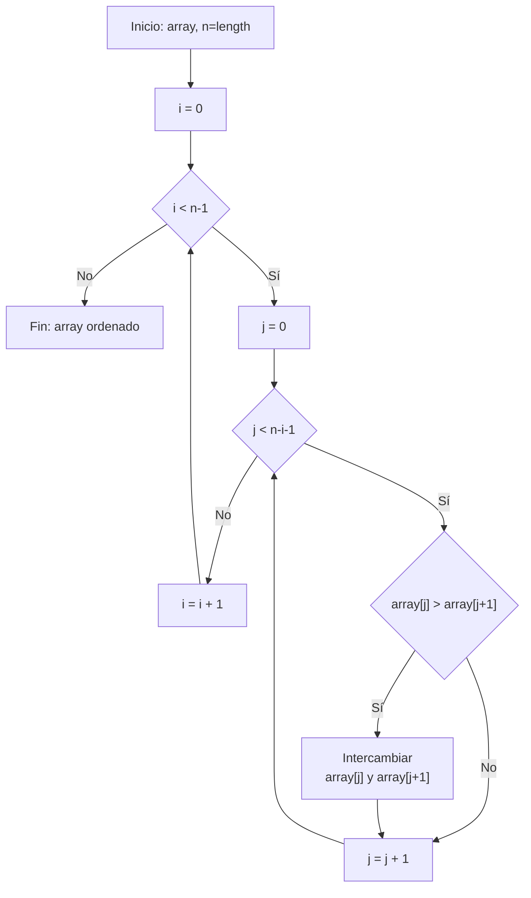
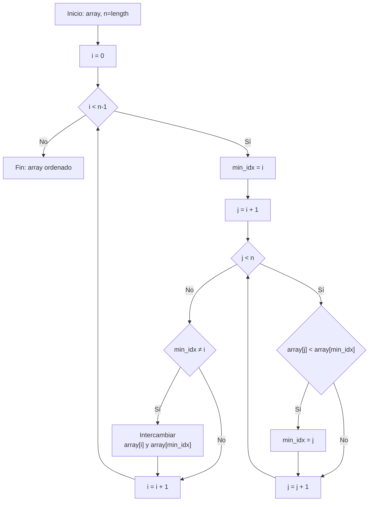
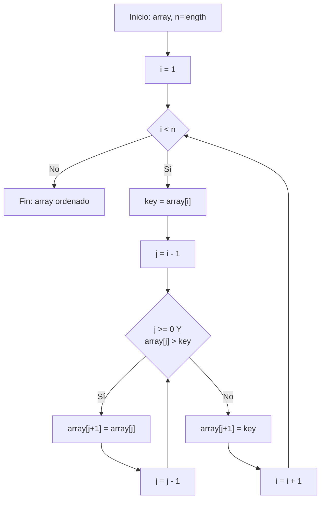
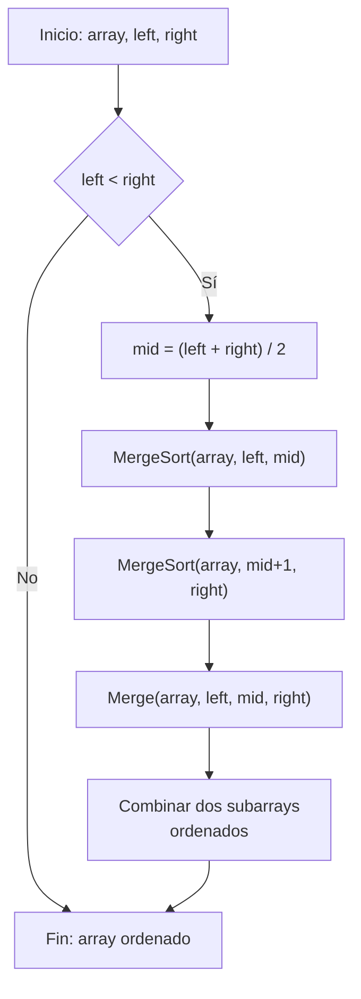
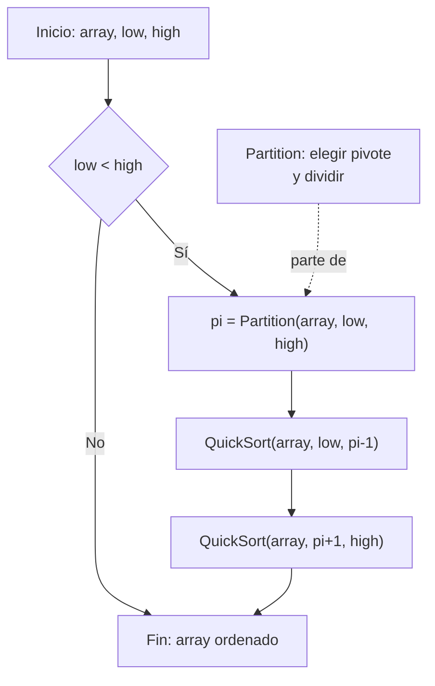
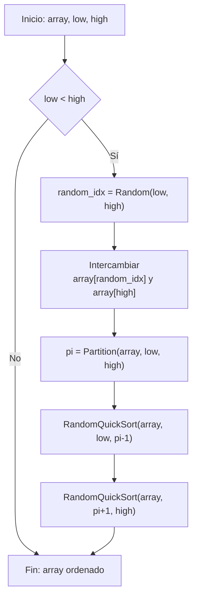
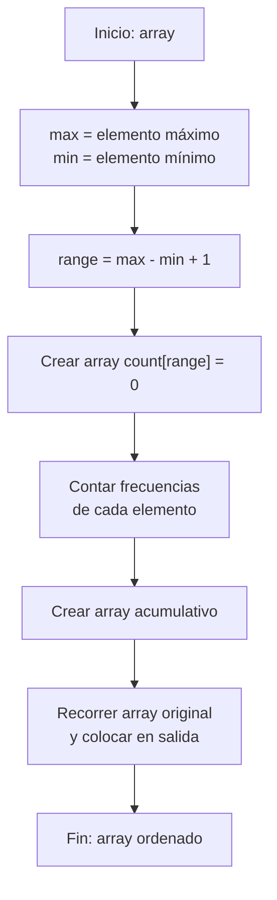

# Algoritmos de Ordenamiento - Diagramas UML 
## Iker Alejandro Soto Mata
### Salvando el semestre

## 1. Bubble Sort

**Descripción:** Compara elementos adyacentes repetidamente e intercambia si están en orden incorrecto. Se repite hasta que la lista esté ordenada.

---

## 2. Selection Sort

**Descripción:** Divide el array en dos partes: ordenada y no ordenada. Encuentra el mínimo en la parte no ordenada y lo coloca al inicio.

---

## 3. Insertion Sort

**Descripción:** Construye el array ordenado de una en una. Toma cada elemento y lo inserta en su posición correcta.

---

## 4. Merge Sort

**Descripción:** Divide el array recursivamente por la mitad, ordena las mitades y las fusiona.

---

## 5. Quick Sort

**Descripción:** Selecciona un pivote, particiona el array en menores y mayores, y ordena recursivamente.

---

## 6. Random Quick Sort

**Descripción:** Similar a Quick Sort pero elige el pivote de forma aleatoria para evitar peor caso.

---

## 7. Counting Sort

**Descripción:** Cuenta la frecuencia de cada elemento y reconstruye el array ordenado.

---

